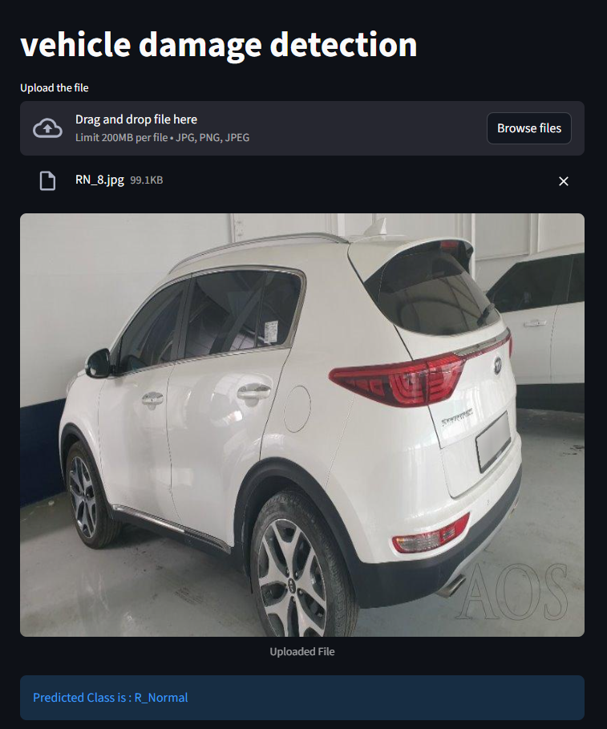

# 🚗 Vehicle Damage Detection App

A deep learning web app that classifies the type and location of damage on a car from a single photo. Upload an image and the model tells you whether the **front** or **rear** of the car is **normal**, **crushed**, or has **breakage**.

Built with **PyTorch** (ResNet50 transfer learning), tuned with **Optuna**, and served through **Streamlit**.



> **Live demo:** _add your deployed app link here_

---

## 📸 Image Guidelines

The model was trained on **three-quarter front and three-quarter rear views** of cars. For reliable predictions, upload a photo that shows the car from one of these angles:

| ✅ Works best | ❌ May give unreliable results |
|---|---|
| Three-quarter front view | Straight side profile |
| Three-quarter rear view | Top-down or interior shots |
| Car fills most of the frame | Close-ups of a single part, or a distant car |

---

## 🧠 Model Details

| | |
|---|---|
| **Architecture** | ResNet50 (pretrained on ImageNet), fine-tuned with a custom classifier head |
| **Classes** | 6 |
| **Dataset size** | ~2,300 images (~1,725 train / 575 validation) |
| **Input size** | 224 × 224 RGB, ImageNet normalization |
| **Loss / Optimizer** | Cross-entropy loss / Adam |
| **Validation accuracy** | **81%** |

### Target Classes

| Index | Class | Description |
|---|---|---|
| 0 | Front Breakage | Broken parts on the front (e.g., bumper, lights) |
| 1 | Front Crushed | Dented or crushed front body |
| 2 | Front Normal | No visible front damage |
| 3 | Rear Breakage | Broken parts on the rear |
| 4 | Rear Crushed | Dented or crushed rear body |
| 5 | Rear Normal | No visible rear damage |

### Hyperparameter Tuning (Optuna)

Optuna was used to search for the best training hyperparameters:

| Hyperparameter | Best value |
|---|---|
| Dropout rate | 0.65 |
| Learning rate | 9.06 × 10⁻⁴ |

---

## 📊 Results

Classification report on the validation set (575 images):

| Class | Precision | Recall | F1-score | Support |
|---|---|---|---|---|
| Front Breakage | 0.91 | 0.82 | 0.87 | 114 |
| Front Crushed | 0.71 | 0.93 | 0.81 | 102 |
| Front Normal | 0.97 | 0.84 | 0.90 | 120 |
| Rear Breakage | 0.80 | 0.80 | 0.80 | 88 |
| Rear Crushed | 0.64 | 0.66 | 0.65 | 76 |
| Rear Normal | 0.83 | 0.76 | 0.79 | 75 |
| **Accuracy** | | | **0.81** | 575 |
| **Macro avg** | 0.81 | 0.80 | 0.80 | 575 |
| **Weighted avg** | 0.82 | 0.81 | 0.81 | 575 |

**Observations**

- **Front Normal** and **Front Breakage** are the strongest classes (F1 0.90 and 0.87).
- **Rear Crushed** is the hardest class (F1 0.65). It has the fewest training examples, and crushed vs. broken damage can look similar.
- **Front Crushed** has high recall (0.93) but lower precision (0.71): the model catches almost all crushed fronts but sometimes labels other front images as crushed.

---

## 🗂️ Dataset

Around 2,300 labeled car images, sourced from the Codebasics deep learning course, based on a vehicle damage dataset published in the journal *Heliyon* by researchers from South Korea.

---

## 🛠️ Tech Stack

- **PyTorch / torchvision** – model building and transfer learning
- **Optuna** – hyperparameter optimization
- **scikit-learn** – evaluation metrics
- **NumPy, Matplotlib** – data handling and visualization
- **Pillow** – image loading and preprocessing
- **Streamlit** – web app interface

---

## 📁 Project Structure

```
├── app.py               # Streamlit app (upload + display prediction)
├── model_helper.py      # Model definition, loading, and predict() function
├── model/
│   └── model.pth        # Trained model weights
├── app_screenshot.jpg   # Screenshot used in this README
├── requirements.txt
└── README.md
```

---

## ⚙️ Setup

1. **Clone the repository**
   ```bash
   git clone https://github.com/shekharJugtwan/<repo-name>.git
   cd <repo-name>
   ```

2. **(Optional) Create a virtual environment**
   ```bash
   python -m venv venv
   source venv/bin/activate        # Windows: venv\Scripts\activate
   ```

3. **Install dependencies**
   ```bash
   pip install -r requirements.txt
   ```
   This installs the CPU version of PyTorch, which is all you need to run the app.
   To **train** on an NVIDIA GPU, install the CUDA build instead:
   ```bash
   pip install torch torchvision --index-url https://download.pytorch.org/whl/cu124
   ```

4. **Run the Streamlit app**
   ```bash
   streamlit run app.py
   ```
   The app opens in your browser at `http://localhost:8501`.

---

## 🔮 Future Improvements

- Collect more images for the weaker classes (especially Rear Crushed) to improve their accuracy
- Add side-view images so the model works from more angles
- Show prediction confidence scores in the app
- Try other architectures (e.g., EfficientNet) and stronger data augmentation

---

## 👤 Author

**Shekhar Jugtwan**
- GitHub: [shekharJugtwan](https://github.com/shekharJugtwan)
- LinkedIn: [shekhar-jugtwan](https://www.linkedin.com/in/shekhar-jugtwan-591067413)

## 🙏 Acknowledgements

- [Codebasics](https://codebasics.io/) for the project guidance and dataset
- The authors of the original vehicle damage dataset published in *Heliyon*
